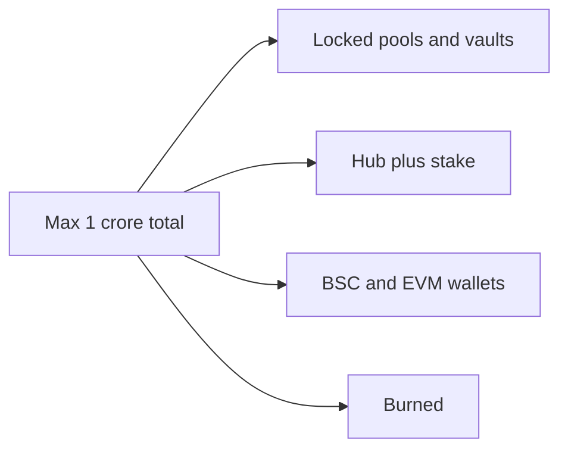

# PNP — universal wallets (one coin, 1 crore global cap)

**PNP coin** works across wallets. **Maximum supply = 1 crore (10 million) for the entire world** — Hub, BSC, Ethereum, and native chain **combined**. No network gets its own separate crore.

**Home chain:** PointPay Chain native `upnp` (`pnp1…`) — when mainnet is ready.  
**EVM networks:** Same **PNP** ticker on BSC / ETH (MetaMask, Trust) — 1:1 from Hub balance, not a second coin.

---

## Global cap (how multi-network stays honest)



When a user **withdraws 100 PNP to BSC**:

- Hub balance −100  
- BSC wallet +100  
- **Total still ≤ 1 crore** — move, not duplicate mint

Public API: `GET /api/public/pnp` → `economy.globalSupply`

---

## Networks & wallets

| Network | Wallets | Address | Status |
|---------|---------|---------|--------|
| **PointPay Hub** | pointpay.exchange | Account login | **Live** |
| **BSC** | MetaMask, Trust, Rabby | `0x…` | Deploy + env (below) |
| **PointPay Chain** | Keplr, Leap | `pnp1…` | After mainnet (later) |
| **Ethereum** | MetaMask, Trust | `0x…` | Optional — same cap rules |

---

## Enable BSC send/receive (MetaMask / Trust)

### 1) Deploy PNP coin contract

[`evm/README.md`](./evm/README.md) — deploy `PNP.sol` on BSC.

**Important:** Contract `maxSupply` = 10M is a **ceiling**. Only mint **hot-wallet float** (e.g. 10k–500k), **not** 1 crore on day one.

### 2) Exchange env

```env
PNP_EVM_WITHDRAW_ENABLED=true
PNP_BEP20_CONTRACT=0xYourContract
PNP_BEP20_DECIMALS=18
PNP_EVM_MIN_WITHDRAW=10
PNP_EVM_DAILY_CAP=50000
```

### 3) User flow

Hub → **Withdraw to BSC wallet** → MetaMask (BSC network) → Add token → Send/receive PNP

---

## User-facing copy

- “**PNP coin** — 1 crore max, all networks combined.”  
- “**Hub** = custodial balance on PointPay.”  
- “**BSC network** = same PNP in your MetaMask/Trust.”  
- Native `pnp1…` = later self-custody on PointPay Chain.

---

## Related

- Product summary: [PNP_COIN.md](./PNP_COIN.md)  
- Deploy: [evm/README.md](./evm/README.md)  
- Support: [SUPPORT_LIVE_VS_MAINNET.md](./SUPPORT_LIVE_VS_MAINNET.md)
